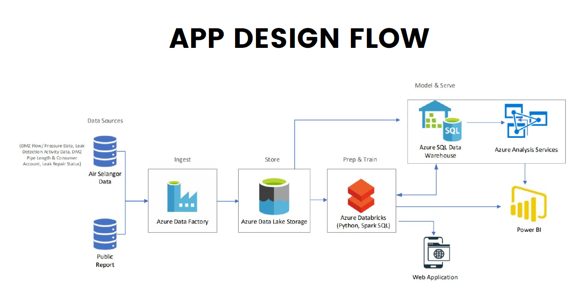
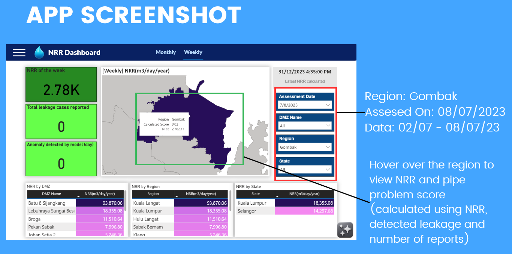

# HydroRise Sentinel: Enterprise Water Leakage Detection 🚰

> **Role:** AI & Data Engineer

> **Scope:** Industrial deployment for Air Selangor (National Water Utility)

> **Performance:** R² Score of 0.87 | Reduced Detection Latency to <24 Hours

## 🔒 NDA & Proprietary Notice
**This repository serves as a technical case study.**
Due to strict Non-Disclosure Agreements (NDA) regarding Critical National Infrastructure (CNI), the source code and raw SCADA datasets cannot be made public. This documentation outlines the system architecture, engineering challenges, and solution design.

## 📖 Project Overview
HydroRise Sentinel is an end-to-end anomaly detection pipeline designed to combat Non-Revenue Water (NRW) loss. Traditional methods relied on manual "Minimum Night Flow" (MNF) calculations which were reactive and slow.

We engineered a cloud-native solution that ingests live SCADA data, predicts leakage events using Machine Learning, and provides an interactive **Hydro AI Assistant** (powered by GPT-4) for field engineers.

## ⚙️ System Architecture
The system processes high-velocity flow and pressure data through a "Medallion" architecture (Bronze/Silver/Gold) on Azure.

*Figure 1: End-to-end pipeline from SCADA Ingestion to Power BI Visualization.*

### Technical Pipeline 
1.  **Ingestion:** Azure Data Factory (ADF) orchestrates data movement from on-premise Air Selangor Databases to **Azure Data Lake Storage (Gen2)**.
2.  **Processing:** **Azure Databricks (PySpark)** performs ETL, cleaning flow rate outliers and segmenting data into 15-minute intervals.
3.  **Modeling:** A **Random Forest Regressor** predicts the "Natural Rate of Rise" (NRR) for each District Metering Zone (DMZ).
4.  **Serving:** Results are pushed to **Azure SQL Data Warehouse** for consumption by Power BI and the Web App.

## 🧠 The AI Engine (Random Forest & GPT-4)

### 1. Leakage Prediction Model
We moved beyond simple thresholding by training a Random Forest model to forecast NRR values based on historical flow dynamics.
* **Model:** Random Forest Regressor
* **Performance:**
    * **R-squared:** 0.87
    * **Mean Absolute Error (MAE):** 166.83
* **Impact:** Allows proactive maintenance by identifying zones with abnormal NRR growth before visible leaks occur.

### 2. Hydro AI Assistant
Integrated the **OpenAI GPT-4 Assistants API** with a "Code Interpreter" tool to allow non-technical staff to query the database using natural language (e.g., *"Which DMZ had the highest leak rate last week?"*).

## 📊 Minimum Night Flow (MNF) Methodology
The core algorithm calculates leakage based on the "Repair Cycle" concept:
1.  **Extraction:** Identify the MNF time window (typically 2:00 AM - 4:00 AM) for each zone.
2.  **Segmentation:** Separate periods *with* repair activity from periods *without* repair activity.
3.  **Calculation:**
    $$NRR = \frac{\Delta MNF}{\Delta Time} \times 365$$
    This differential calculation isolates the "natural" rise in leakage from operational noise.

## 📉 Dashboard & Visualization
The system feeds a live Power BI dashboard for executive monitoring.

*Figure 2: Geospatial view of leakage severity across Selangor districts.*

## 🏆 Key Achievements
* **Automated Analytics:** Replaced manual Excel-based NRR calculations with automated PySpark jobs.
* **High Accuracy:** Achieved **87% accuracy** in forecasting leakage trends.
* **User Empowerment:** Deployed a GenAI chatbot to democratize data access for field technicians.
